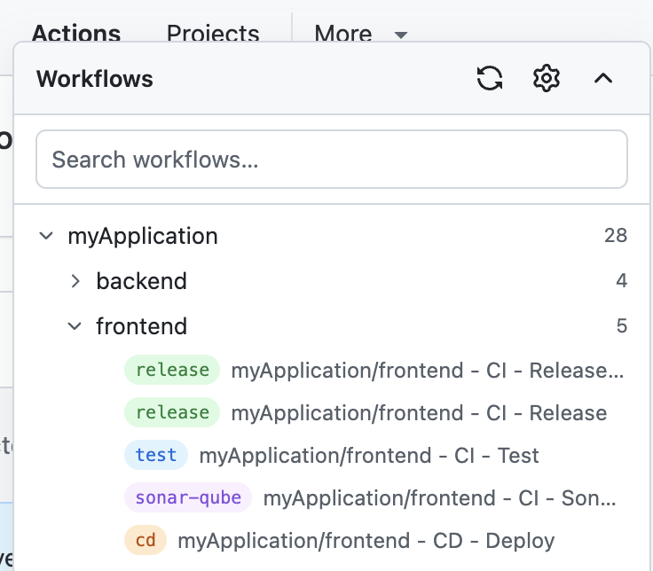

# GitHub Workflow Navigator

This Chrome extension adds a panel to the GitHub Actions page that allows you to navigate to the workflow definition.

> [!NOTE]  
> This browser extension is not affiliated with GitHub.

## Features

* Search for workflows by name
* Automatic tree structure of workflows based on configurable naming conventions
* Optional configurable badges for labeling workflows
* Authentication via PAT token or GitHub OAuth App with Device Flow
* Configurable panel visibility: auto-detect from pattern match, minimum workflow count threshold, and per-repository allow/block list

## Screenshots

### The extension panel

### Settings

#### Authentication

#### Parsing

#### Visibility

## Installation

1. Clone this repository
2. Open `chrome://extensions/` in your browser
3. Enable `Developer mode`
4. Click `Load unpacked` and select the `extension` folder
5. Open a GitHub Actions page and enable the extension.
6. Configure the authentication method.
7. Enjoy!